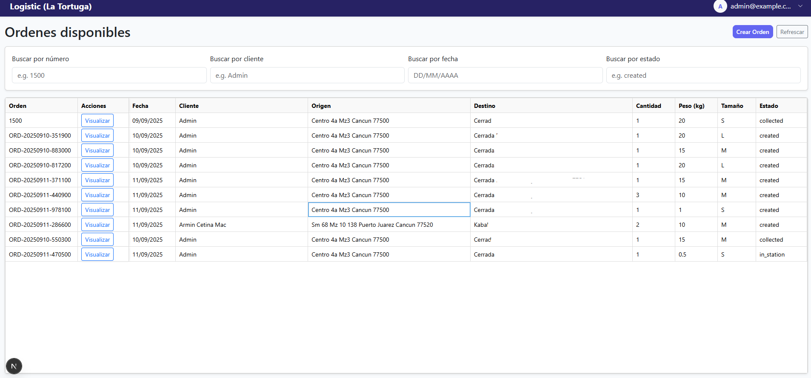

# Logistics Fullstack (Go + Next.js)


Solución MVP para la prueba técnica. Incluye:
- Backend en Go 1.25 con GORM y PostgreSQL, JWT, roles client/admin, y reglas de negocio para órdenes.
- Frontend en Next.js (App Router) con React Hooks.
- Orquestación con Docker Compose.
- Colección Postman.

## Cómo ejecutar
1. Requisitos: Docker y Docker Compose.
2. En el directorio raíz, ejecutar:
```
docker compose up --build
```
3. Servicios:
- API: http://localhost:8080
- Web: http://localhost:3000
- Postgres: localhost:5432 (usuario: postgres / pass: postgres / DB: logistics)

## Documentación
- Backend: backend/README.md
- Frontend: frontend/README.md
- Postman: postman/Logistics.postman_collection.json

## Notas de Arquitectura
- Inspirado en Clean Architecture: domain (entidades), usecase (reglas), repository (adaptadores), delivery/http (handlers), infra/db (gorm+postgres).
- PostgreSQL: elegido por consistencia ACID, capacidades avanzadas y extensiones (PostGIS) útiles en logística.

## Roadmap
- Validaciones por país de direcciones; normalización y geocodificación.
- Tests de integración y CI.
