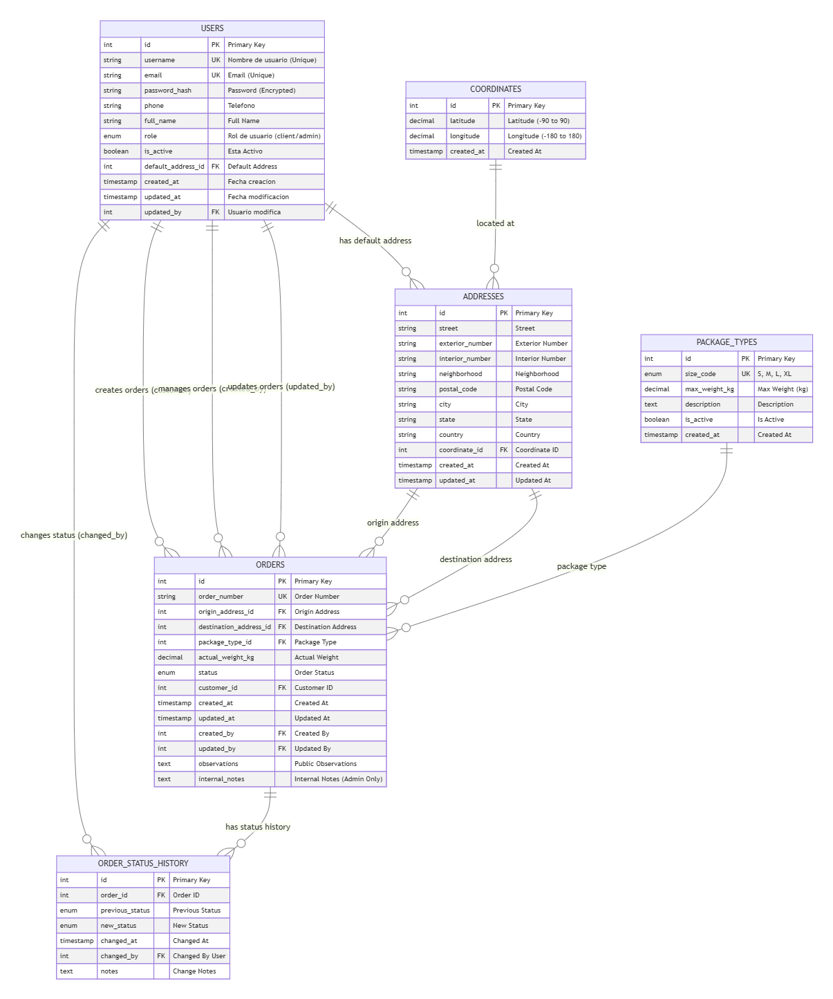
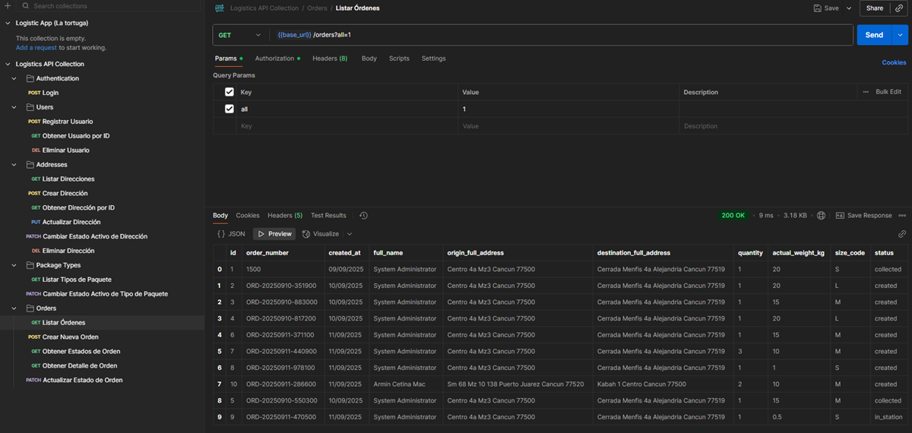

# Backend (Go + Mux + GORM + PostgreSQL)

Este backend implementa una API para gestión de órdenes con autenticación JWT y roles (cliente y admin) siguiendo una estructura inspirada en Clean Architecture.

## Requisitos
- Go 1.25
- Docker / Docker Compose

## Estructura
- cmd/api: punto de entrada
- internal/domain: entidades (Order, User)
- internal/usecase: casos de uso (OrderService, PackageService, AddressService, UserService)
- internal/repository: implementación GORM
- internal/infra/db: conexión a Postgres
- internal/delivery/http: handlers HTTP y autenticación

## Endpoints (MVP)

## Endpoints (MVP)

### Auth

- POST /api/login => body: {email, password} devuelve token JWT
- POST /api/users => registrar usuario (body: {email, password, full_name, phone, role?})

### Usuarios

- GET /api/users/{id} => obtener usuario por ID (admin o el propio usuario)
- DELETE /api/users/{id} => eliminar usuario (admin o el propio usuario)

### Direcciones

- GET /api/addresses => listar direcciones (cliente => propias; admin => todas con ?all=1)
- POST /api/addresses => crear dirección con coordenadas opcionales
- GET /api/addresses/{id} => obtener dirección por ID
- PUT /api/addresses/{id} => actualizar dirección
- DELETE /api/addresses/{id} => eliminar dirección
- PATCH /api/addresses/{id}/active => activar/desactivar dirección

### Órdenes

- GET /api/orders => listar órdenes (cliente => propias; admin => todas con ?all=1)
- POST /api/orders => crear orden
- GET /api/orders/{id} => obtener detalle de orden
- PATCH /api/orders/{id}/status => actualizar estado (admin)
- GET /api/orders/status => listar estados disponibles

### Tipos de paquetes

- GET /api/package-types => listar tipos de paquete (activos por defecto, admin puede ver inactivos con ?all=1)
- PATCH /api/package-types/{id}/active => activar/desactivar tipo de paquete (admin)

## Reglas de negocio: 
- tamaño del paquete según peso (S ≤5kg, M ≤15kg, L ≤25kg). Si peso>25kg => error solicitando convenio especial.
- Validación de órdenes por role
- Valición de direcciones por role
- Validación de coordenadas
- Validacion de direcciones
- Validación de seguridad
- Validación cambio de estado en órdenes

## Ejecutar en local cn Makefile: Make [targets]
### Targets disponibles:
#### dev    - Ejecuta tests y si pasan, inicia el servidor con Air
#### test   - Ejecuta todos los tests en la carpeta $(TEST_DIR)
#### swag   - Genera la documentación Swagger (swag init)
#### build  - Compila el binario en $(BIN)
#### run    - Ejecuta el binario compilado
#### clean  - Limpia artefactos temporales
#### deps   - Descarga dependencias de Go
#### tools  - Instala herramientas (air, swag)

## Ejecutar con Docker
```
docker compose up --build
```
La API quedará en http://localhost:8080

## Variables de entorno relevantes
- POSTGRES_HOST, POSTGRES_PORT, POSTGRES_USER, POSTGRES_PASSWORD, POSTGRES_DB
- JWT_SECRET

## Justificación PostgreSQL
PostgreSQL ofrece integridad ACID, tipos avanzados (jsonb), extensiones geoespaciales (PostGIS) ideales para logística, y es excelente con GORM por su madurez.


## Postman
En la carpeta postman/ se incluye una colección con ejemplos (login cliente, crear orden, listar, actualizar status, etc).



