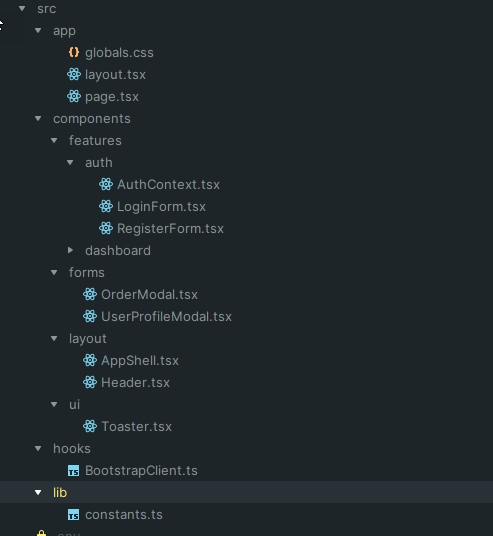

# Frontend (Next.js + Hooks + JWT)

Este frontend incluye las vistas para el sistema Logistics App, se permitira creación y consulta de órdenes, y actualización de estatus.

## Scripts
- npm run dev: inicia en desarrollo (http://localhost:3000)
- npm run build && npm start: producción

## Variables de entorno
- NEXT_PUBLIC_API_BASE: URL base de la API (por defecto http://localhost:8080)
- NEXT_PUBLIC_GOOGLE_MAPS_API_KEY: API Key de Google Maps

## Estructura



## Ejecución con Docker
Este frontend se levanta con docker-compose junto a la API y la base de datos:
```
docker compose up --build
```
